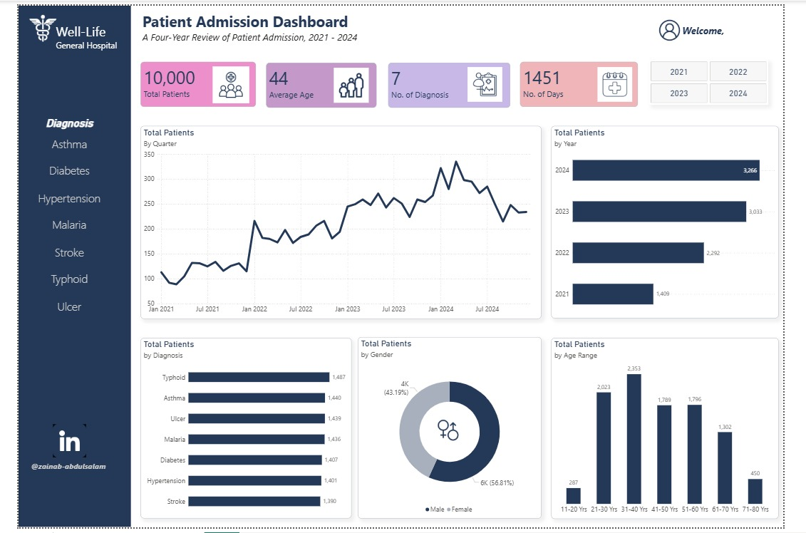
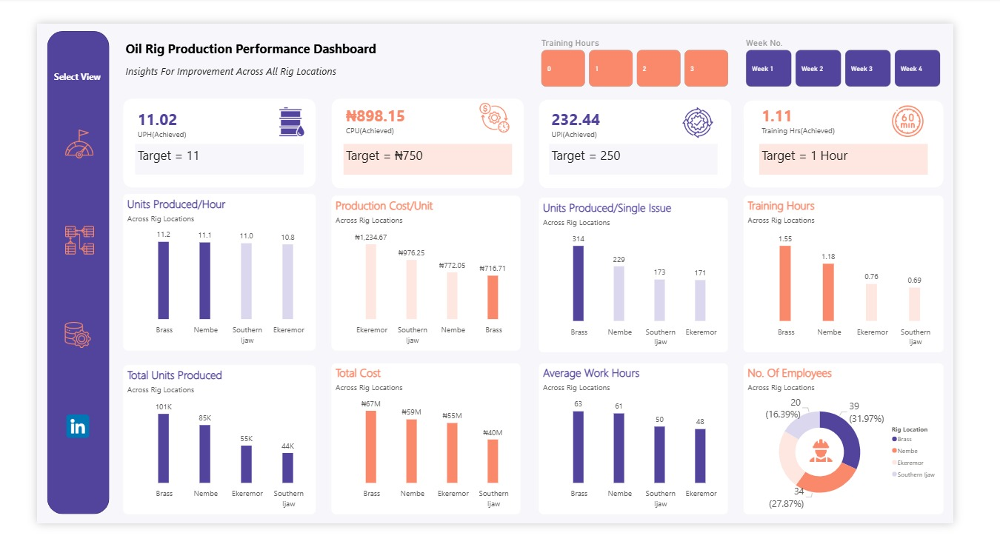

# Data-Analytics-Portfolio
## ABOUT ME
Hello! I am Zainab Abdulsalam, an Economics graduate and Data Analytics professional. I am passionate about turning data into insight. I transform raw and complex information into clear, actionable narratives that support informed decision-making and business growth.
With a strong analytical mindset and a commitment to continuous learning, I focus on helping organizations understand their data, solve problems, and make smarter, evidence-based decisions.

## SKILLS
Data Cleaning and Tranformation

Data Visualization - (Power BI, Excel)

Dashboard and Report Building

A selection of Dashboards I have designed and Developed

## MY PROJECTS

## Contact
