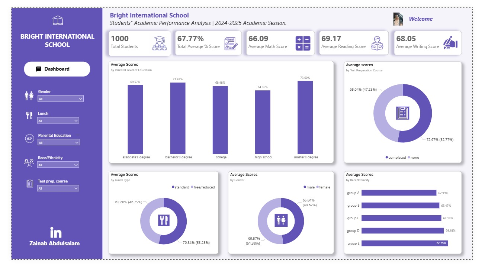

# Data-Analytics-Portfolio
## ABOUT ME
Hello! I am Zainab Abdulsalam, an Economics graduate and Data Analytics professional. I am passionate about turning data into insight. I transform raw and complex information into clear, actionable narratives that support informed decision-making and business growth.
With a strong analytical mindset and a commitment to continuous learning, I focus on helping organizations understand their data, solve problems, and make smarter, evidence-based decisions.

## SKILLS
Data Cleaning and Tranformation

Data Visualization - (Power BI, Excel)

Dashboard and Report Building

A selection of Dashboards I have designed and Developed
 

# MY PROJECTS

## Students' Performance Analysis

In this project, I analyzed student academic performance at Bright International Schools during the 2024/2025 academic session. The objective was to identify key factors influencing student outcomes and provide data-driven recommendations to improve academic performance, enhance student retention, and support increased enrollment.
Data from a dataset of 1,000 students indicates an overall average student score of 67.77%. The analysis reveals that test preparation, lunch type (a proxy for socioeconomic status), parental education level, and race/ethnicity have measurable impacts on student performance.
Key findings show that students who completed a test preparation course achieved an average score of 72.67%, outperforming those who did not (65.04%) by 7.63 percentage points. Similarly, students with standard lunch options scored 70.84%, compared to 62.20% for students on free/reduced lunch, a gap of 8.64 percentage points, highlighting the influence of socioeconomic factors.
Parental education also plays a significant role. Students whose parents held a Master’s degree achieved average score of (73.60%). The analysis suggests that combining test preparation programs and improved nutrition access could increase the overall average score from 67.77% to 75.51%. With stronger parental engagement and educational support, average performance could rise further to 82.63%.
Improving academic outcomes through these interventions is expected to strengthen the school’s reputation, leading to higher student enrollment and retention. [View Report Here](https://drive.google.com/file/d/1lUpKFwB76FUr5N4oTAff5mus-Egkzanr/view?usp=sharing)

## Patients' Admission Analysis

In this project I analyzed patient admissions at WellLife Hospital over a four-year period (2021–2024), focusing on seven major diagnoses: Asthma, Diabetes, Hypertension, Malaria, Typhoid, Ulcer, and Stroke. The primary objective of this analysis is to support data-driven decision-making aimed at improving resource allocation, operational efficiency, and patient care delivery.
The analysis covers 10,000 patient records and reveals that male patients (56.81%) outnumber female patients (43.19%). Admission trends show a consistent year-on-year increase, indicating rising healthcare demand. Patients under the age of 21 account for a minimal share of admissions, suggesting that hospital utilization is significantly higher among adults and older populations.
Key findings indicate that Typhoid recorded the highest number of cases between 2021 and 2023, predominantly among individuals aged 21–40 years. However, there was a sharp decline in typhoid cases in Q1 2024, with no recorded cases thereafter—likely due to improved environmental sanitation and public health sensitization. A similar trend is observed with Malaria, which declined significantly in Q3 2024 and recorded no subsequent admissions.
Asthma and Hypertension affect both genders almost equally. Asthma is most prevalent among the economically active population (21–50 years), potentially linked to workplace exposure, urban pollution, and stress. Hypertension is most common among older adults (41–70 years) and has shown a steady increase over the years. Both conditions require gender-inclusive intervention strategies.
Conversely, Ulcer, Diabetes, and Stroke are male-dominated diagnoses, primarily affecting middle-aged, older, and elderly populations. These conditions show a consistent upward trend across the four years and may be strongly associated with lifestyle and dietary habits. Increased health awareness among men, especially as they age, is essential.
Based on these findings, it is recommended that WellLife Hospital reallocates resources toward high-growth and high-burden diagnoses—specifically Asthma, Hypertension, Diabetes, Ulcer, and Stroke, while reducing investment in declining cases such as Typhoid and Malaria. This strategic shift will help eliminate waste, optimize spending, and enhance patient care outcomes.
[View Report Here](https://drive.google.com/file/d/1d_DuM_Rz1dP8ISMKsdwNkLGbkFDLwr9_/view?usp=drive_link)

# Contact
Email: adebukolazainab5@gmail.com

Phone: +2348104452454

LinkedIn: [ZainabAbdulsalam](https://www.linkedin.com/in/zainababdulsalam01?lipi=urn%3Ali%3Apage%3Ad_flagship3_profile_view_base_contact_details%3BrMezkWMOTc6YbF8k0Zxihg%3D%3D)
