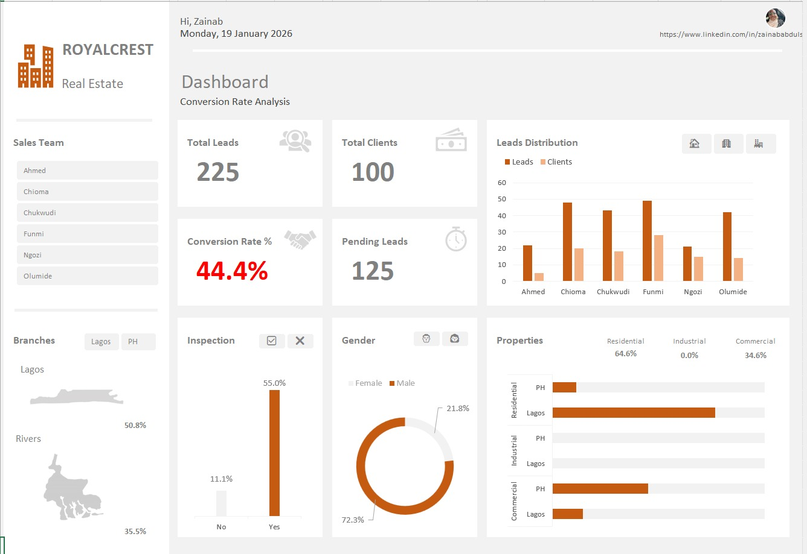
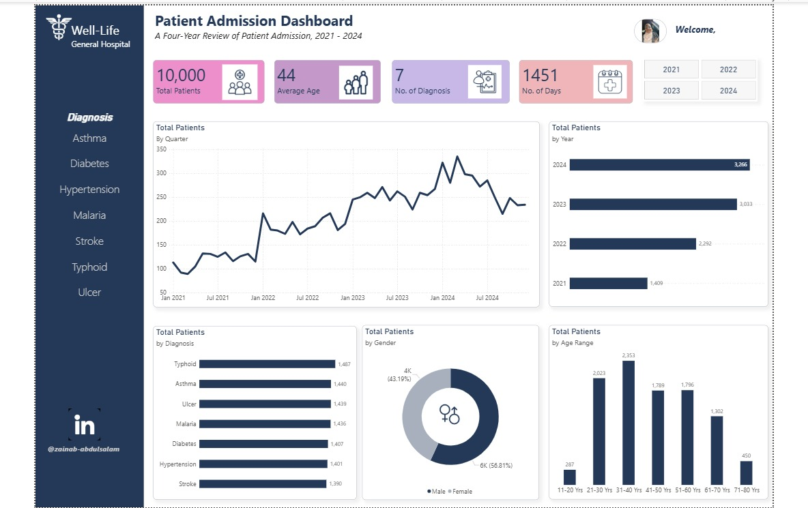
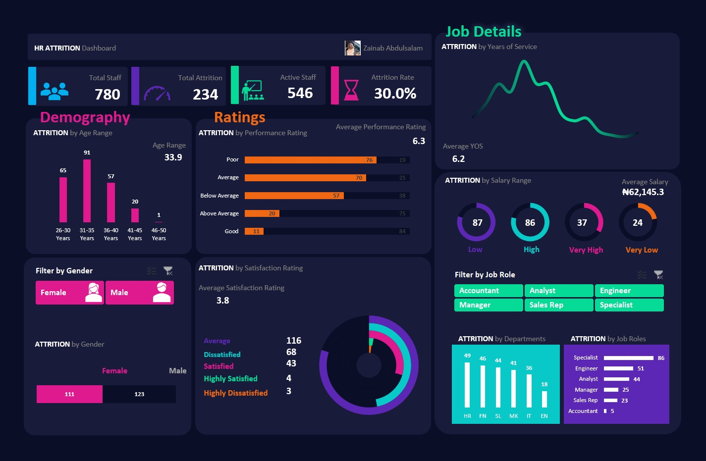
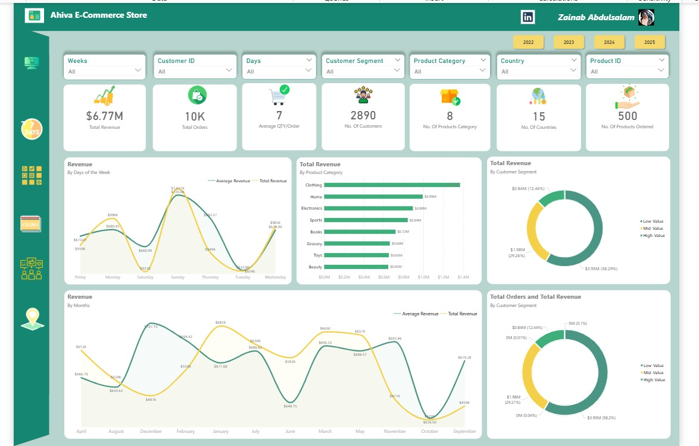
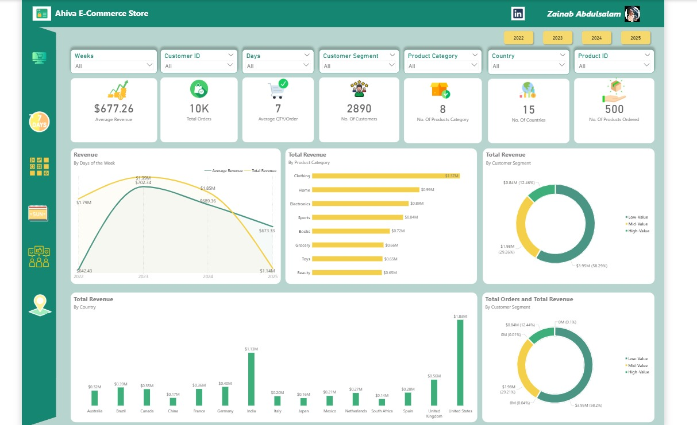

# Data-Analytics-Portfolio
## ABOUT ME
Hello! I am Zainab Abdulsalam, an Economics graduate and Data Analyst. I transform raw and complex information into clear, actionable narratives that support informed decision-making and business growth.
With a strong analytical mindset and a commitment to continuous learning, I focus on helping organizations understand their data, solve problems, and make smarter, evidence-based decisions.

## SKILLS
Data Cleaning and Tranformation
[Check here](https://www.linkedin.com/posts/zainababdulsalam01_dataanalytics-dataorganization-datacleaning-activity-7368324473655095298-pxyx?utm_source=share&utm_medium=member_desktop&rcm=ACoAACUYo5MBDWF5XCVxKCi7QAvC1ZPYbNsljuw)

Data Visualization - (Power BI, Excel)

Dashboard and Report Building

### A selection of Dashboards I have designed

 Dashboard built in Power BI

 Dashboard built in Excel

# MY PROJECTS

### Students' Performance Analysis
At Bright International School, I helped identify and address key factors influencing student outcomes. Through targeted improvements, the school achieved a ****14.86%** increase in academic performance**. This measurable progress strengthened student retention and enhanced the school’s reputation, ultimately driving a significant rise in new student enrollment.
. [View Report](https://drive.google.com/file/d/1lUpKFwB76FUr5N4oTAff5mus-Egkzanr/view?usp=sharing)

### Patients' Admission Analysis
I contributed to enhancing operational efficiency at WellLife Hospital, by analyzing patient admission trends. The findings revealed a significant decline in certain diagnoses, enabling the hospital **to restrategize resource allocation toward predominant illnesses**. This optimization reduced wastage, improved patient care delivery, and ultimately led to increased revenue.
[View Report](https://drive.google.com/file/d/1d_DuM_Rz1dP8ISMKsdwNkLGbkFDLwr9_/view?usp=drive_link)

### HR Attrition Analysis
In this project, I analyzed a datase of 780 Employees. I uncovered key patterns and drivers behind why staff leave a particular Organization.

Quick Facts about the organization
Total Staff: 780
Attrition (Staff): 234
Active Staff: 546
Attrition Rate: 30%
[Read More](https://www.linkedin.com/posts/zainababdulsalam01_dataanalytics-excel-attritionanalysis-activity-7400093613692547072-SNWH?utm_source=share&utm_medium=member_desktop&rcm=ACoAACUYo5MBDWF5XCVxKCi7QAvC1ZPYbNsljuw)

### E-Commerce Store Revenue Analysis
I analyzed the sales revenue of an E-commerce store with two clear goals:
- Help the business understand how money flows across operations.
- Build actionable, results-driven insights to drive revenue growth.
[Read More](https://www.linkedin.com/posts/zainababdulsalam01_datastory-datamodelling-dataanalytics-activity-7371456385277980672-It4_?utm_source=share&utm_medium=member_desktop&rcm=ACoAACUYo5MBDWF5XCVxKCi7QAvC1ZPYbNsljuw)

[Continue Reading](https://www.linkedin.com/posts/zainababdulsalam01_datastorytelling-revenueanalysis-dataanalytics-activity-7375286047045320705-VonL?utm_source=share&utm_medium=member_desktop&rcm=ACoAACUYo5MBDWF5XCVxKCi7QAvC1ZPYbNsljuw)

[final Report](https://www.linkedin.com/posts/zainababdulsalam01_dataanalytics-ecommerce-datastorytelling-activity-7377673162475573248-7Uul?utm_source=share&utm_medium=member_desktop&rcm=ACoAACUYo5MBDWF5XCVxKCi7QAvC1ZPYbNsljuw)

## Contact Details
Email: adebukolazainab5@gmail.com

Phone: +2348104452454

[My Resume](Zainab-Abdulsalam-Data Analyst Resume.pdf)

LinkedIn: [ZainabAbdulsalam](https://www.linkedin.com/in/zainababdulsalam01?lipi=urn%3Ali%3Apage%3Ad_flagship3_profile_view_base_contact_details%3BrMezkWMOTc6YbF8k0Zxihg%3D%3D)
