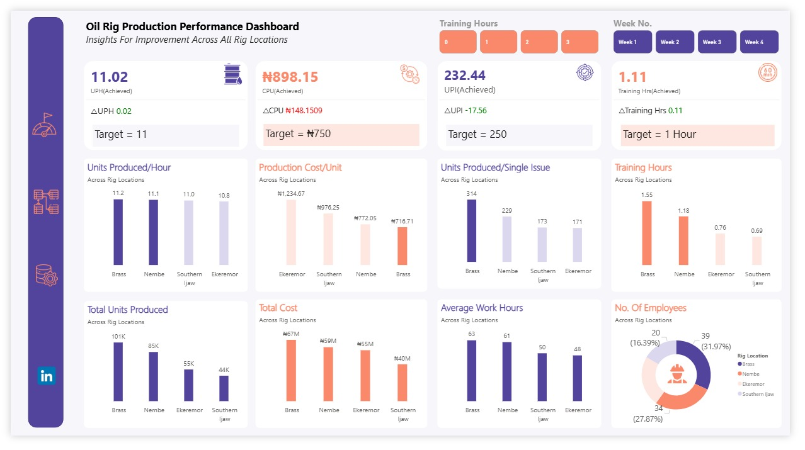
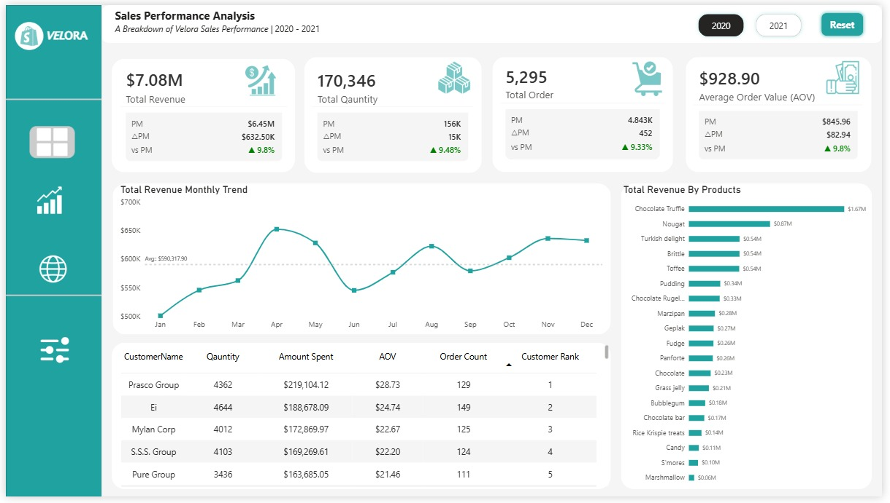
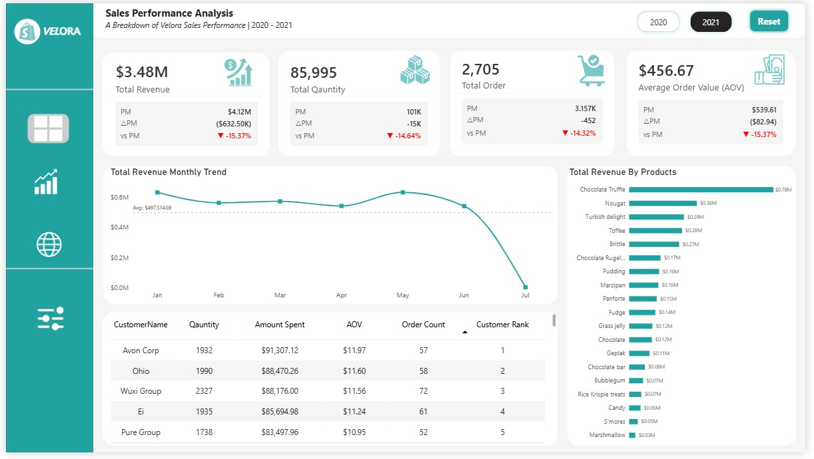

# Data-Analytics-Portfolio
## ABOUT ME
Hello! I am Zainab Abdulsalam, an Economics graduate and Data Analyst. I transform raw and complex information into clear, actionable narratives that support informed decision-making and business growth.
With a strong analytical mindset and a commitment to continuous learning, I focus on helping organizations understand their data, solve problems, and make smarter, evidence-based decisions.

## SKILLS
- Data Cleaning and Tranformation
[Check here](https://www.linkedin.com/posts/zainababdulsalam01_dataanalytics-dataorganization-datacleaning-activity-7368324473655095298-pxyx?utm_source=share&utm_medium=member_desktop&rcm=ACoAACUYo5MBDWF5XCVxKCi7QAvC1ZPYbNsljuw)

- Data Visualization And Dashboard - (Power BI, Excel)

- Automation

- Report Writing

- AI-Enhanced Data Analytics

### A selection of Dashboards I have designed

Dashboard built in Power BI
## 
[Interract with the Dashboard here](https://app.powerbi.com/view?r=eyJrIjoiZmFlZmMzZmMtZjMwYS00NmEwLWIyYTItNzFjYTQ5Y2YzZmFlIiwidCI6ImZiODhhYjNjLWU1YjMtNDQyOS05MDQzLTU1MGQ2ZThlZjA1NyJ9)

Dashboard built in Excel
##### 
[Interract with the Dashboard Here](https://1drv.ms/x/c/94db7e40c894e793/IQDNrLzgXOMHRLZg6QJRlywGARVRu03v9yHk4rkDCs2pxmA?e=5W1uLL)

## PROJECTS I HAVE WORKED ON

### 1. Students' Performance Analysis
At Bright International School, I helped identify and address key factors influencing student outcomes. Through targeted improvements, the school achieved a **14.86% increase in academic performance**. This measurable progress strengthened student retention and enhanced the school’s reputation, ultimately driving a significant rise in new student enrollment. [View Report](https://drive.google.com/file/d/1lUpKFwB76FUr5N4oTAff5mus-Egkzanr/view?usp=sharing)

[Interract with the Dashboard here](https://app.powerbi.com/view?r=eyJrIjoiNjIwNjg4YjMtMDJjYS00NWMxLTkxZTgtNDA2ODA0ODUyZDY3IiwidCI6ImZiODhhYjNjLWU1YjMtNDQyOS05MDQzLTU1MGQ2ZThlZjA1NyJ9)

### 2. Patients' Admission Analysis
I contributed to enhancing operational efficiency at WellLife Hospital, by analyzing patient admission trends. The findings revealed a significant decline in certain diagnoses, enabling the hospital **to restrategize resource allocation toward predominant illnesses**. This optimization reduced wastage, improved patient care delivery, and ultimately led to increased revenue.
[View Report](https://drive.google.com/file/d/1d_DuM_Rz1dP8ISMKsdwNkLGbkFDLwr9_/view?usp=drive_link)

[Interract with the Dashboard Here](https://app.powerbi.com/view?r=eyJrIjoiZjhjMzBmODEtZmRhOC00MDgxLTk2NjgtYzMyN2E2NTkwNGE4IiwidCI6ImZiODhhYjNjLWU1YjMtNDQyOS05MDQzLTU1MGQ2ZThlZjA1NyJ9)

### 3. HR Attrition Analysis
This project analyzed employee attrition, I identified the key factors driving a high 30% staff turnover in an organization.
Through data analysis of **780 employees**, I uncovered patterns related to age, salary level, department, job role, and employee satisfaction that contributed to staff leaving.
Based on these insights, I recommended targeted retention strategies including **improved remuneration, employee welfare, career development, and focused support for high-risk groups** to reduce attrition. [Read More](https://www.linkedin.com/posts/zainababdulsalam01_dataanalytics-excel-attritionanalysis-activity-7400093613692547072-SNWH?utm_source=share&utm_medium=member_desktop&rcm=ACoAACUYo5MBDWF5XCVxKCi7QAvC1ZPYbNsljuw)

[Interract with the Dashboard here](https://1drv.ms/x/c/94db7e40c894e793/IQDe_58PUxB9TJeC5num-BS6AaapWFqo4NgJ_TTzVr4NQY0?e=YxdHqN)

### 4. Sales Performance Analysis
This project analyzed Velora Stores’ sales performance, revealing a **51%** revenue decline in the first Year and a sharp **−99%** drop in the second year, indicating possible operational or data disruptions.
Through the analysis, I identified key issues such as **revenue concentration in few products/regions, declining customer value, and regional performance gaps** affecting overall sales stability.
Based on these insights, I recommended **validating operations, strengthening high-performing products, improving pricing and basket size, and prioritizing high-value customers and channels**. [Read More](SALES PERFORMANCE REPORT.pdf)

[Interract with the Dashboard Here](https://app.powerbi.com/view?r=eyJrIjoiODRmZGRjMjQtYWVkMC00ZWYxLTkzNDMtNmEzOWRiY2JlMWY5IiwidCI6ImZiODhhYjNjLWU1YjMtNDQyOS05MDQzLTU1MGQ2ZThlZjA1NyJ9)

## Contact Details
Email: adebukolazainab5@gmail.com

Phone: +2348104452454

[My CV](https://drive.google.com/file/d/1gCRUpjWqxnEiZ1X5AlpyMoq54p5Gh_bE/view?usp=sharing)

LinkedIn: [ZainabAbdulsalam](https://www.linkedin.com/in/zainababdulsalam01?lipi=urn%3Ali%3Apage%3Ad_flagship3_profile_view_base_contact_details%3BrMezkWMOTc6YbF8k0Zxihg%3D%3D)
