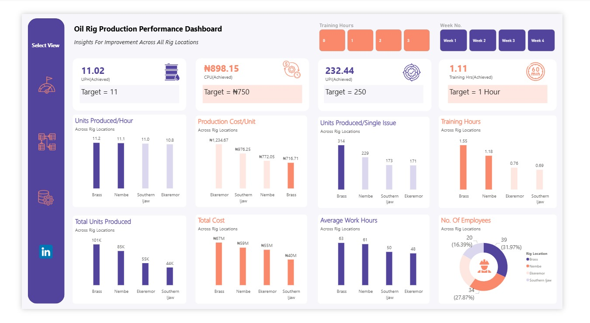
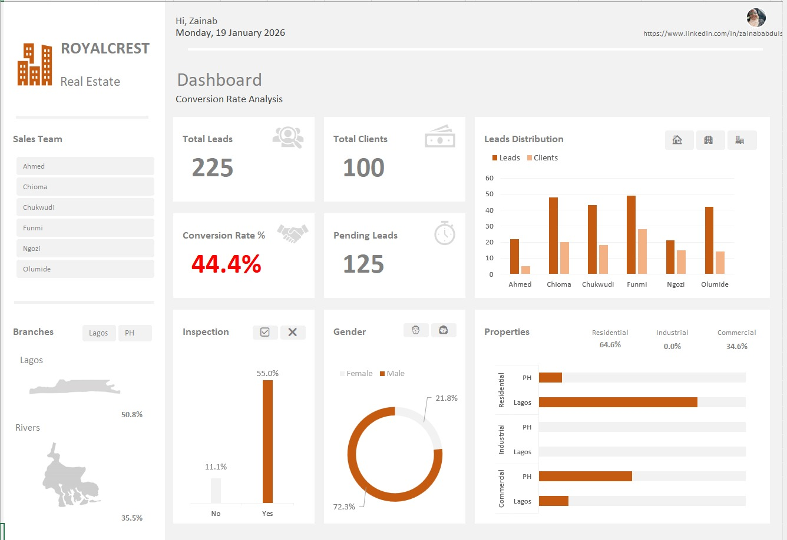
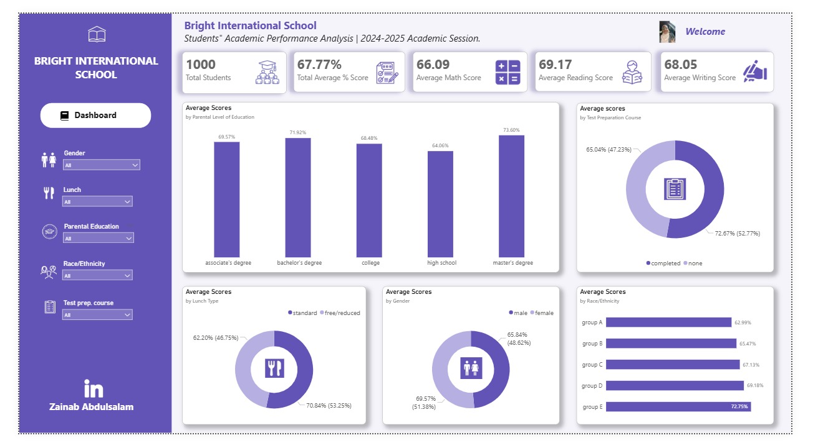
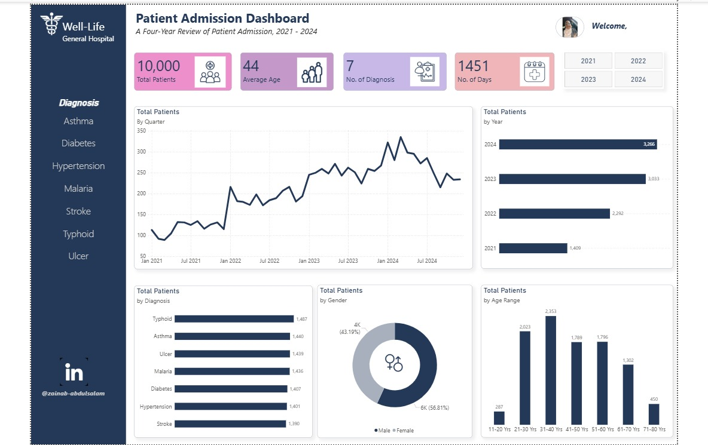
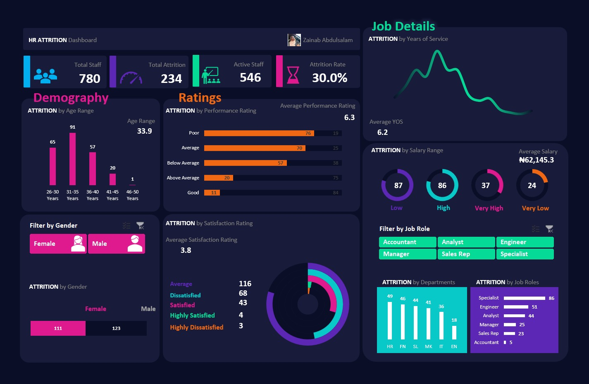

# Data-Analytics-Portfolio
## ABOUT ME
Hello! I am Zainab Abdulsalam, an Economics graduate and Data Analyst. I transform raw and complex information into clear, actionable narratives that support informed decision-making and business growth.
With a strong analytical mindset and a commitment to continuous learning, I focus on helping organizations understand their data, solve problems, and make smarter, evidence-based decisions.

## SKILLS
Data Cleaning and Tranformation
[Check here](https://www.linkedin.com/posts/zainababdulsalam01_dataanalytics-dataorganization-datacleaning-activity-7368324473655095298-pxyx?utm_source=share&utm_medium=member_desktop&rcm=ACoAACUYo5MBDWF5XCVxKCi7QAvC1ZPYbNsljuw)

Data Visualization - (Power BI, Excel)

Dashboard and Report Building

### A selection of Dashboards I have designed

 Dashboard built in Power BI

[Interract with the Dashboard here](https://app.powerbi.com/view?r=eyJrIjoiZmFlZmMzZmMtZjMwYS00NmEwLWIyYTItNzFjYTQ5Y2YzZmFlIiwidCI6ImZiODhhYjNjLWU1YjMtNDQyOS05MDQzLTU1MGQ2ZThlZjA1NyJ9)

 Dashboard built in Excel

# MY PROJECTS

### Students' Performance Analysis
At Bright International School, I helped identify and address key factors influencing student outcomes. Through targeted improvements, the school achieved a **14.86% increase in academic performance**. This measurable progress strengthened student retention and enhanced the school’s reputation, ultimately driving a significant rise in new student enrollment. [View Report](https://drive.google.com/file/d/1lUpKFwB76FUr5N4oTAff5mus-Egkzanr/view?usp=sharing)

[Interract with the Dashboard here](https://app.powerbi.com/view?r=eyJrIjoiNjIwNjg4YjMtMDJjYS00NWMxLTkxZTgtNDA2ODA0ODUyZDY3IiwidCI6ImZiODhhYjNjLWU1YjMtNDQyOS05MDQzLTU1MGQ2ZThlZjA1NyJ9)

### Patients' Admission Analysis
I contributed to enhancing operational efficiency at WellLife Hospital, by analyzing patient admission trends. The findings revealed a significant decline in certain diagnoses, enabling the hospital **to restrategize resource allocation toward predominant illnesses**. This optimization reduced wastage, improved patient care delivery, and ultimately led to increased revenue.
[View Report](https://drive.google.com/file/d/1d_DuM_Rz1dP8ISMKsdwNkLGbkFDLwr9_/view?usp=drive_link)

[Interract with the Dashboard Here](https://app.powerbi.com/view?r=eyJrIjoiZjhjMzBmODEtZmRhOC00MDgxLTk2NjgtYzMyN2E2NTkwNGE4IiwidCI6ImZiODhhYjNjLWU1YjMtNDQyOS05MDQzLTU1MGQ2ZThlZjA1NyJ9)

### HR Attrition Analysis
In this project, I analyzed a datase of 780 Employees. I uncovered key patterns and drivers behind why staff leave a particular Organization.

Quick Facts about the organization
Total Staff: 780
Attrition (Staff): 234
Active Staff: 546
Attrition Rate: 30%
[Read More](https://www.linkedin.com/posts/zainababdulsalam01_dataanalytics-excel-attritionanalysis-activity-7400093613692547072-SNWH?utm_source=share&utm_medium=member_desktop&rcm=ACoAACUYo5MBDWF5XCVxKCi7QAvC1ZPYbNsljuw)

### Sales Performance Analysis
Analyzed Velora Stores’ sales performance (Jan 2020–Jul 2021) to identify revenue drivers and causes of the sharp 2021 decline. The analysis revealed heavy revenue concentration, declining customer value, and a possible operational disruption. Recommendations focus on validating operations, strengthening top-performing products, and improving pricing and customer targeting to drive revenue growth.
[Read More](SALES PERFORMANCE REPORT.pdf)

## Contact Details
Email: adebukolazainab5@gmail.com

Phone: +2348104452454

[My CV](https://drive.google.com/file/d/1D6yIfb5gOQYHjxI3m8udnmVtGd1IOHNu/view?usp=sharing)

LinkedIn: [ZainabAbdulsalam](https://www.linkedin.com/in/zainababdulsalam01?lipi=urn%3Ali%3Apage%3Ad_flagship3_profile_view_base_contact_details%3BrMezkWMOTc6YbF8k0Zxihg%3D%3D)
